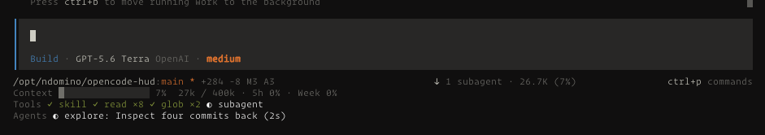

# OpenCode HUD

[](https://www.npmjs.com/package/@ndom91/opencode-hud)
[](https://www.npmjs.com/package/@ndom91/opencode-hud)
[](./LICENSE)
[](https://opencode.ai)

OpenCode 2 plugin that displays a persistent status HUD below the text input in
the TUI. It is a native TUI plugin, not an assistant-message renderer, so it
does not add HUD content to a session transcript.



## Install

Add it to the `plugins` array in `~/.config/opencode/cli.json`, for example:

```json
{
  "plugins": [
    "@ndom91/opencode-hud"
  ]
}
```

OpenCode downloads and loads the package. Restart OpenCode after changing the configuration.

> [!WARNING]
> To show `5h` and `weekly` Codex subscription usage, the HUD plugin queries the OpenAI endpoint through
> your system's Codex authorization. This is disabled by default. See [PRIVACY.md](./PRIVACY.md) before
> enabling it with the `codexUsage` package option. This is the same mechanism as used by
> [CodexBar](https://github.com/steipete/CodexBar/) and others.

## Status Rows

The default HUD can show the following native TUI data:

- Project path, branch, dirty state, and local change summary.
- Session context usage, including an amber `compaction likely soon` warning at
  80% usage and the active compaction state.
- Up to two running shell commands and the four most recent tool activities.
- The most recent failed tool for 15 seconds. A new user turn clears the
  failure row.
- Up to three running subagents, including elapsed time and their own context
  percentage.
- Optional Codex 5-hour and weekly usage limits.

## Configuration

The default HUD shows all available status rows. Disable individual groups with
package options in `~/.config/opencode/cli.json`:

```json
{
  "plugins": [
    {
      "package": "@ndom91/opencode-hud",
      "options": {
        "agents": false,
        "codexUsage": true,
        "compaction": false,
        "context": true,
        "git": true,
        "shell": true,
        "tools": true
      }
    }
  ]
}
```

| Option | Controls |
| --- | --- |
| `agents` | Running subagents, elapsed time, and context usage |
| `codexUsage` | Disabled by default. Set to `true` to show Codex 5-hour and weekly usage limits. |
| `compaction` | Active compaction state and the 80% context warning |
| `context` | Current session context usage |
| `git` | Branch, dirty state, and change summary |
| `shell` | Running shell commands |
| `tools` | Recent tool activity and brief tool-failure row |

## Local Development

Requirements:

- `opencode2`
- Node.js 24+

Install dependencies and validate the project:

```sh
pnpm install
pnpm format
pnpm typecheck
pnpm test
```

Start OpenCode from this repository:

```sh
opencode2 .
```

OpenCode discovers `.opencode/plugins/tui/status.tsx` automatically. Start or
open a session to see the HUD under the prompt.

> [!NOTE]
> The OpenCode 2 plugin API is beta and liable to change. Please check [NOTES.md](./NOTES.md) and validate
against the installed `@opencode-ai/plugin` runtime types if making changes.

## License

MIT
