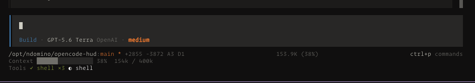

# OpenCode HUD

An experimental persistent status HUD for the OpenCode 2 terminal UI. It is a
native TUI plugin, not an assistant-message renderer, so it does not add HUD
content to a session transcript.



## Local Development

Requirements:

- `opencode2` v0.0.0-beta-18387 or a compatible newer beta
- Node.js 24+

Install dependencies and validate the TypeScript source:

```sh
pnpm install
pnpm check
pnpm test
```

Start OpenCode from this repository:

```sh
opencode2 .
```

OpenCode discovers `.opencode/plugins/tui/status.tsx` automatically. Start or
open a session to see the HUD under the prompt.

## Probe Data

`probes/status.tsx` is retained only as a diagnostic for the beta plugin API.
It writes a full assistant-message sample to `opencode-hud-probe.json` in the
active project. That file is ignored and may contain sensitive session data;
do not commit or share it.

## Compatibility

The OpenCode 2 plugin API is beta. Check [NOTES.md](./NOTES.md) and validate
against the installed `@opencode-ai/plugin` runtime types after every OpenCode
upgrade.
