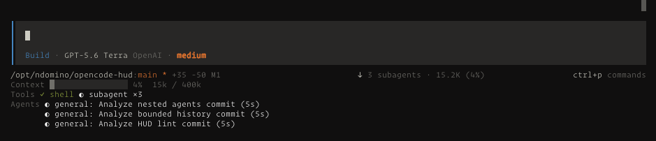

# OpenCode HUD

OpneCode2 plugin to display a persistent status HUD below the text input in the
TUI. It is a native TUI plugin, not an assistant-message renderer, so it does not add HUD
content to a session transcript.



## 👨‍🏭 Setup

Requires Node.js 24+ and pnpm.

```sh
git clone https://github.com/ndom91/opencode-hud.git ~/.config/opencode/opencode-hud
cd ~/.config/opencode/opencode-hud
pnpm install --frozen-lockfile
```

Add the plugin file to the `plugins` array in `~/.config/opencode/opencode.jsonc`:

```jsonc
{
  "plugins": [
    "/Users/<username>/.config/opencode/opencode-hud/.opencode/plugins/tui/status.tsx"
  ]
}
```

## 🧑‍💻 Local Development

Requirements:

- `opencode2` v0.0.0-beta-18387 or a compatible newer beta
- Node.js 24+

Install dependencies and validate the TypeScript source:

```sh
pnpm install
pnpm check
pnpm test
```

Start OpenCode from this repository:

```sh
opencode2 .
```

OpenCode discovers `.opencode/plugins/tui/status.tsx` automatically. Start or
open a session to see the HUD under the prompt.

## 🔌 Compatibility

The OpenCode 2 plugin API is beta. Check [NOTES.md](./NOTES.md) and validate
against the installed `@opencode-ai/plugin` runtime types.

## 📝 License

MIT
